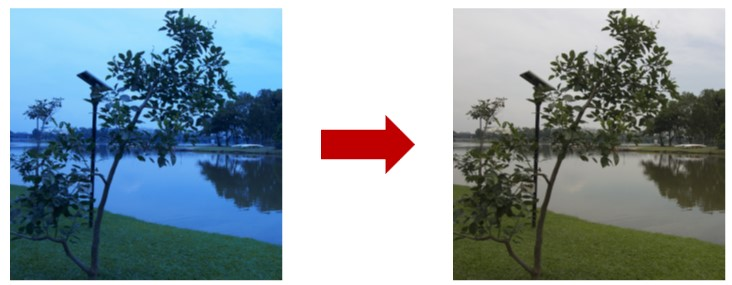
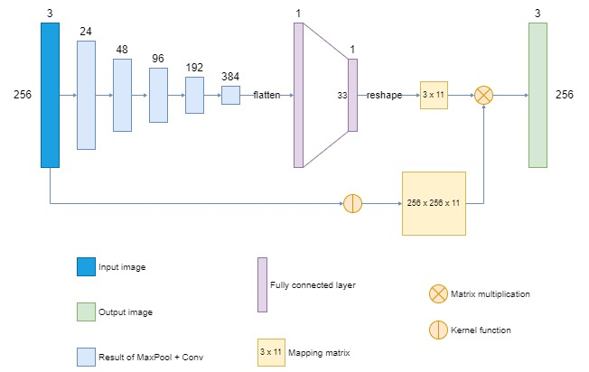
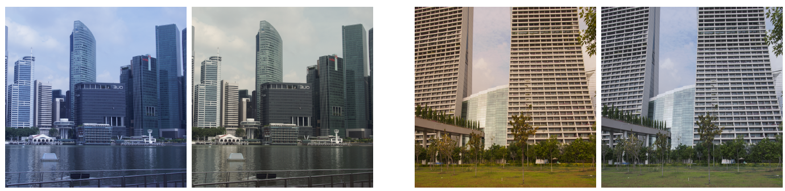
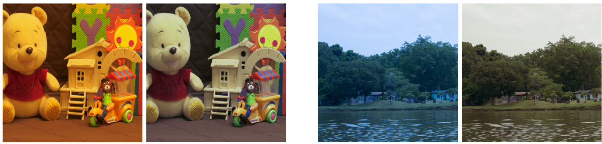
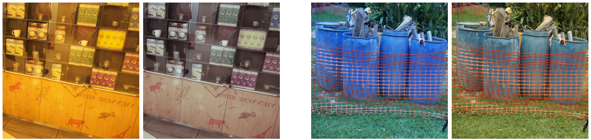
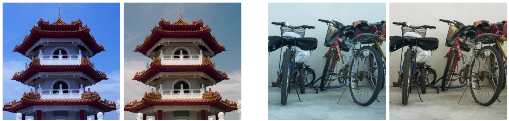

# Color Constancy 
(Color balancing)  
The project was completed during the internship in Viettel High Tech (Viettel Digital Talent 2022 program)

[Report](https://drive.google.com/file/d/1A-nvZO_RCmA-c3SX1Q_GYYyGfqUscIUb/view?usp=sharing)

## Input and output

## Model architecture

## Result
Accuracy is approximately as SOTA methods but twice the speed

### Visual result
Left: input, right: output

## How to infer using this model
See notebook `notebooks/Test inference.ipynb`